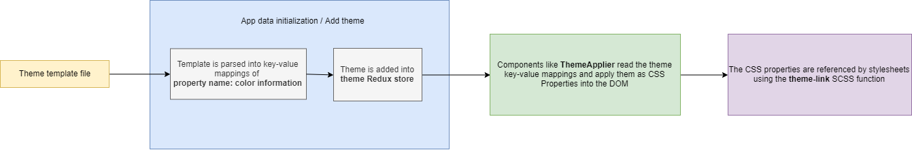

# Theming

DDB 2.0 uses a custom templating system to allow for a relatively easy and dynamic theming experience for developers.


## Background

On the lowest level, the theming system uses [CSS custom properties](https://developer.mozilla.org/en-US/docs/Web/CSS/--*) to map theme color information to different components which allows them to get dynamically updated in real-time whenever any of the properties changes (i.e. the theme is changed).

To help aid in theme development, a simple templating system was developed in order to make theming easier and more readable.


## System Overview

The diagram below describes the process of how the theming system works.




## Template configuration

In order to use the template system the template must first be defined. 

There are four main components in a template definition:

1. `subSections`: the different sub-sections (usually used for components) in the theme template.

2. `baseProperties`: the different property types that each sub-section will contain.

3. `propertyVaritations`: the different color variations that each base property will have.

4. `customBaseProperties`: these are extra base properties that are specific to the targetted sub-sections.

In DDB 2.0 its theme template definition is located at `src/themes/definitions/index.js`


## Creating a Theme

**Basic Structure**
```js
const template = {
    // The unique ID of the theme
    id: String,
    // The color used to represent the theme
    displayColor: Color String, 

    BASE: {
        [basePropertyName]: {
            [propertyVaritation]: Color String
            // ...all property varitations here
        }
        // ...all base properties here

        // Ex:
        "scrollbar-color": {
            "primary": "rgb(85, 85, 85)",
            "secondary": "rgb(68, 68, 68)"
        }
    },
    subSections: {
        // ...any color overrides specific to a sub-section
        // Note: this includes any extra defined custom base properties

        // Ex:
        "icon": {
            "text-color": {
                "primary": "rgb(180, 180, 180)"
            },
            "accent-color": {
                "primary": "rgb(187, 245, 255)",
                "secondary": "rgb(240, 240, 240)"
            },
            "custom-property": {
                "primary": "#999FFF"
            }
        },
    }
}
export const template;
```

Each theme template has a `BASE` section which defines the base colors for all the different sub-sections. Whenever no override styles exist in a sub-section, these styles will be used. All `baseProperties` along with their `propertyVariations` must be defined here.

Individual sub-section color overrides can also be defined in the `subSections` section of the template. This is useful for when a component needs a different color than the one defined in `BASE`.

For a full-fledged example of a theme used in DDB 2.0 check out `src/themes/presets/ocean.js`.

::: tip 
If a section is left undefined by the theme the fallback color defined by that theme will be used.
:::


## Link Styles to Theme

In order to make linking styles to the theme relatively easy, the SCSS function `theme-link` located at `/src/styles/functions/index.scss` is available to use.

This function handles expanding out the theme link information into a form that the browser recognizes and accepts.

**Usage**
```scss
// Function definition
propertyName: theme-link($section, $property, $variation, $opacity: 1);

// Ex 1:
color: theme-link("header", "text-color", "secondary");

// Ex 2:
backgroundColor: theme-link("TabView", "bg-color", "primary", 0.5);
```