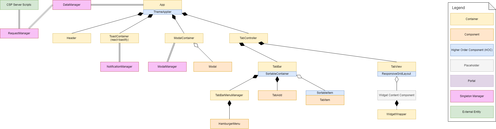
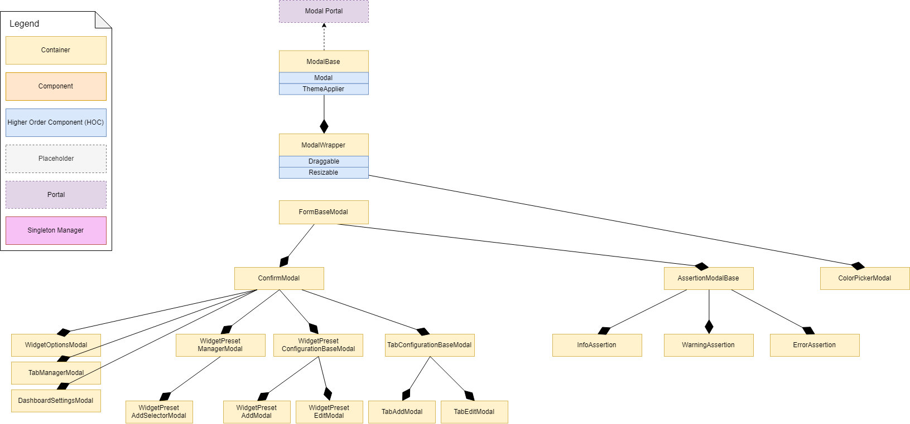
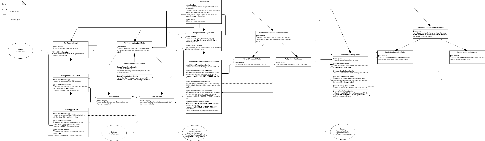

# Structure
[draw.io Diagram](https://www.draw.io/?state={%22ids%22:[%2210B81KHZmO_tTNIFRcfObNwBl_bxMD3GA%22],%22action%22:%22open%22,%22userId%22:%22103642088792933800941%22}#G10B81KHZmO_tTNIFRcfObNwBl_bxMD3GA)

## App Structure

## Modal Structure

## Modal System Callback Flow

